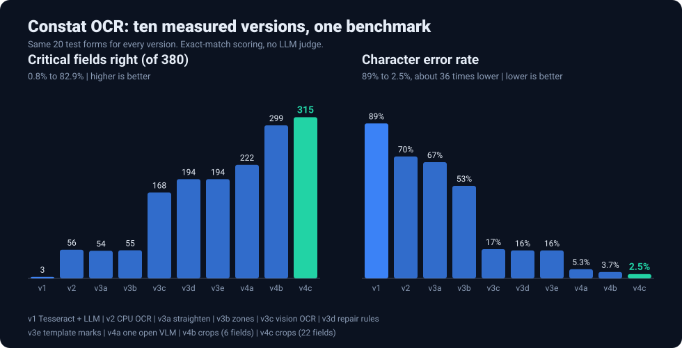

# constat-ocr

Extract structured data from photos of the Moroccan **constat amiable** (the handwritten car-accident report), and measure
how well it works. Built as a series of versions: each one exists because the previous one measurably failed.

## TL;DR

**Character error rate 89% to 2.5% (about 36 times lower). Critical fields right 0.8% to 82.9%.** Ten controlled versions, one frozen benchmark,
one open 27B vision model, no fine-tuning.

- **Result (20 test forms, exact-match scoring):** 315 of 380 critical fields right (v1: 3), 501 of 600 minor fields (v1: 12), ticks and
  categories exact, 4 of 20 forms with every critical field right (v1: 0).
- **Stack:** Qwen3.8-27B (Apache 2.0) on a Modal H100 with vLLM behind a proxy token. No OCR engine, no text LLM, no third-party LLM API.
- **What worked:** diagnose first (92% of v1's errors were values the OCR never read), read ticks with no model (the form is a fixed template),
  and when prompt tuning stalled, change the pixels (crop and enlarge each field at its known place: critical fields 58% to 83%).
- **Limits:** synthetic forms, 20 test forms for the pipeline headline, a person is still needed on 16 of 20 forms, about $0.04 of GPU per form.



| Version | The one change | Critical fields right (of 380) | Character error rate |
|---|---|---|---|
| v1 | Tesseract + LLM (baseline) | 3 (0.8%) | 89% |
| v2 | PP-OCRv6 on CPU | 56 (14.7%) | 70.1% |
| v3a | Straighten the photo | 54 (14.2%) | 66.8% |
| v3b | Sort the text by zone | 55 (14.5%) | 53.2% |
| v3c | Chandra-OCR-2 vision OCR on a GPU | 168 (44.2%) | 16.8% |
| v3d | Deterministic repair rules | 194 (51.1%) | 16.1% |
| v3e | Ticks and tiles read from the template, no model | 194 (51.1%), marks exact | 16.1% |
| v4a | One open vision model reads the page | 222 (58.4%) | 5.3% |
| v4b | Re-read 6 digit fields from enlarged crops | 299 (78.7%) | 3.7% |
| v4c | Crop 22 fields | **315 (82.9%)** | **2.5%** |

**Why the character error rate:** field accuracy says whether a value is exactly right; the character error rate also says how far off the
wrong ones are, so it shows progress field accuracy hides (in v3b the critical fields barely moved while it fell 13 points).

## Version by version

**v4c crops the other fields too** (22 in all, with the header), the last iteration of v4: **315 of 380 critical fields right, 501 of 600 minor, character error rate 2.5%, 4 of 20 forms
with no critical error** (v4b: 299, 482, 3.7%, 2). About $0.04 per form of GPU time. Details in [docs/results-log.md](docs/results-log.md#v4c-crop-the-remaining-fields-the-last-iteration-of-v4).

**v4b re-reads the six hardest digit fields from enlarged crops** of the page, at their known template positions, with the same Qwen server, and changes nothing else.
On the same 20 test forms: **299 of 380 critical fields right (v4a: 222, v3e: 194)**, character error rate 3.7%, and the **first 2 forms with no critical error**.
The licence number went from 12 to 27 of 40 right and the validity dates from 16 to 34 and 28 to 40. It costs about $0.043 per form of GPU time (v3e: about $0.019).
Details in [docs/results-log.md](docs/results-log.md#v4b-re-read-the-hard-digit-fields-from-crops).

**v4a replaces the OCR step and the text LLM with one open vision model** (Qwen3.8-27B on a GPU) that reads the page and returns the record.
On the same 20 test forms: **222 of 380 critical fields right (v3e: 194), 482 of 600 minor (381), character error rate 5.3% (16.1%)**, no LLM bill,
but about $0.029 of GPU time per form against about $0.019 for v3e (Chandra GPU plus the LLM), so about 1.5 times dearer. Still 0 of 20 forms without a critical error: licence numbers are the weakest field (12 of 40). Full table
and the prompt iterations in [docs/results-log.md](docs/results-log.md#v4a-one-open-vision-model-reads-the-page-and-fills-the-record).

**v3e reads the ticks, tiles and circles from the form template** with plain image processing and changes nothing else. Results below.

**v3d repairs the record after the LLM with small deterministic rules** and changes nothing else. Results below.

**v3c replaces the OCR engine with Chandra-OCR-2**, an OCR vision model served on a GPU, and changes nothing else. Results below.

**v3b sorts the OCR text by zone of the form** (header, vehicle A, circumstances, vehicle B) and changes nothing else. Results below.

**v3a adds one step before OCR** (straighten the photo) and changes nothing else.

**v2 swaps the OCR engine** (PP-OCRv6 on CPU) and changes nothing else.

**v1 is the baseline:** [Tesseract](https://github.com/tesseract-ocr/tesseract) reads the photo, then Groq's
`gpt-oss-120b` fills a typed record from the text. No image cleanup, no vision model.

```
photo ──► Tesseract ──► LLM (JSON mode) ──► record ──► scored against the answer key
```

## Why synthetic data
Real constats hold personal data and are not public. So the project generates its own: handwritten, phone-photographed
forms with an exact answer key, from a seed. The 500-form dataset is frozen and every version is scored on the same forms.
See [docs/synthetic-data.md](docs/synthetic-data.md).

## The 6 metrics
1. **Field accuracy**, for critical fields (plate, policy number, dates...) and minor ones (addresses, names...)
2. **Forms with no critical error**
3. **Character error rate**
4. **Checkbox score**: ticks found, missed, extra
5. **Category accuracy** (vehicle type, impact zone) next to the "always guess the most common" score
6. **Cost and time**

Details: [docs/metrics.md](docs/metrics.md).

## v1 results (20 test forms)
As expected, not good.

| | |
|---|---|
| Critical fields right | 3 of 380 (0.8%) |
| Forms with no critical error | 0 of 20 |
| Character error rate | 89% |
| Cost | $0.0009 per form |

**The problem is Tesseract, not the LLM.** It does not extract the text properly from tilted phone photos, handwriting and the
Arabic-labelled column, so 92% of the wrong values were never in the text the LLM received. The LLM only lost 8%. Ticks,
circled letters and pictures cannot be read from text at all. That is what v2 has to fix. Full analysis:
[docs/results-log.md](docs/results-log.md).

## v2 results (same 20 test forms)
Only the OCR engine changed: PP-OCRv6 through RapidOCR (CPU) instead of Tesseract. Same LLM, prompt and forms.

| | v1 (Tesseract) | v2 (PP-OCRv6) |
|---|---|---|
| Critical fields right | 3 of 380 (0.8%) | 56 of 380 (14.7%) |
| Forms with no critical error | 0 of 20 | 0 of 20 |
| Character error rate | 89% | 70% |
| OCR time per form | 2.2 s | 4.2 s |
| Cost per form | $0.0009 | $0.0010 |

- **Better reader, same bottleneck.** 81% of wrong values were never in the OCR text (92% in v1).
- **Vehicle B is still nearly unread:** 7 of 440 text fields right, against 105 of 440 for vehicle A.
- **Ticks, vehicle type and impact zone stay at zero.** Text-only cannot read them.
- **Engine chosen on 5 dev forms**, ahead of PP-OCRv5, docTR and Tesseract. The public benchmark shortlisted, it did not pick.

Details: [docs/results-log.md](docs/results-log.md).

## v3a results (same 20 test forms)
Only one step added: the photo is found against the desk and warped flat before OCR (OpenCV). Same OCR engine, LLM, prompt and forms as v2.

| | v2 | v3a (straightened) |
|---|---|---|
| Critical fields right | 56 of 380 (14.7%) | 54 of 380 (14.2%) |
| Forms with no critical error | 0 of 20 | 0 of 20 |
| Character error rate | 70.1% | 66.8% |
| Cost per form | $0.0010 | $0.0010 |

- **Straightening alone changes almost nothing.** Correct text fields: 143 of 980, against 144 in v2.
- **The OCR engine was already coping with the tilt.** The unread values are mostly handwriting misreads.
- **It is the prerequisite for the next change:** reading each column of the form on its own, so vehicle B's values are no longer mixed with the circumstance lines.

Details: [docs/results-log.md](docs/results-log.md).

## v3b results (same 20 test forms)
The straightened page is read once, then each text box is assigned to a zone by position (cuts found per form from the printed green
strips) and the LLM gets four labelled blocks instead of one mixed stream. Same OCR engine, LLM and forms; the prompt only describes
the new text layout.

| | v2 | v3a | v3b |
|---|---|---|---|
| Critical fields right | 56 of 380 (14.7%) | 54 of 380 (14.2%) | 55 of 380 (14.5%) |
| Minor fields right | 88 of 600 (14.7%) | 89 of 600 (14.8%) | 99 of 600 (16.5%) |
| Forms with no critical error | 0 of 20 | 0 of 20 | 0 of 20 |
| Character error rate | 70.1% | 66.8% | 53.2% |
| Vehicle B text fields right | 7 of 440 | 7 of 440 | 26 of 440 |
| Cost per form | $0.0010 | $0.0010 | $0.0011 |

- **The split fixed what it targeted.** Vehicle B went from 7 to 26 fields right, and the character error rate fell by 13 points.
- **The critical total did not move:** vehicle A lost 8 critical fields, probably because the new prompt makes the model more careful. The
  layout change and the prompt change were made together, so this run cannot separate them.
- **The ceiling is the reading, not the layout:** 676 of 980 values are not in the OCR text. The next gain has to come from a better
  handwriting reader.

Details: [docs/results-log.md](docs/results-log.md).

## v3c results (same 20 test forms)
The reader is **Chandra-OCR-2** (Datalab, 5.3B) on an H100 through vLLM on Modal, instead of RapidOCR. It reads the straightened page, returns
layout blocks with their positions, and also reports checkboxes and picture descriptions. Same LLM, forms and zone blocks as v3b; the prompt only
describes the new text. PaddleOCR-VL and DeepSeek-OCR-2 were tried first and dropped: they are built for printed documents and looped on
the handwritten form.

| | v2 | v3b | v3c |
|---|---|---|---|
| Critical fields right | 56 of 380 (14.7%) | 55 of 380 (14.5%) | **168 of 380 (44.2%)** |
| Minor fields right | 88 of 600 (14.7%) | 99 of 600 (16.5%) | **377 of 600 (62.8%)** |
| Forms with no critical error | 0 of 20 | 0 of 20 | 0 of 20 |
| Character error rate | 70.1% | 53.2% | **16.8%** |
| Vehicle B text fields right | 7 of 440 | 26 of 440 | **200 of 440** |
| Ticks found / missed / extra | 1 / 24 / 12 | 0 / 25 / 0 | **10 / 15 / 4** |
| OCR time per form | 4.2 s (CPU) | 4.3 s (CPU) | 55 s (H100, 13 pages in parallel) |
| LLM cost per form | $0.0010 | $0.0011 | $0.0012 (GPU time not included) |

- **The reader was the ceiling.** Values never in the OCR text fell from 676 to 377 of 980, and the LLM now loses almost nothing (8 values in the
  text and not returned).
- **Still not usable without a human:** no form has all its critical fields right, plates and policy, attestation and licence numbers are the
  weakest fields, and the category answers (vehicle type, licence category, impact zone) are worse than always guessing the most common value.
- **Speed is memory bandwidth:** generating was about 8 times faster per token on an H100 than on an L4 (one page took 200 s on an L4). Details, and why, in
  [docs/serving.md](docs/serving.md).

Details: [docs/results-log.md](docs/results-log.md).

## v3d results (same 20 test forms, same OCR and LLM outputs as v3c)
One optional step after the LLM: rules that put a swapped pair of validity dates in order, remove stray spaces from phone, policy and attestation
numbers. The v3c outputs were reused, so the rules are the only difference and no GPU or LLM call was made.

| | v3c | v3d |
|---|---|---|
| Critical fields right | 168 of 380 (44.2%) | **194 of 380 (51.1%)** |
| Minor fields right | 377 of 600 (62.8%) | **381 of 600 (63.5%)** |
| Forms with no critical error | 0 of 20 | 0 of 20 |
| Character error rate | 16.8% | **16.1%** |

- **40 fields changed, 30 became right, none that was right became wrong.** Dates in order gave 18 of the gain.
- **One rule is trusted only on synthetic data:** the attestation number format is the generator's. Without it the gain is +19 critical, not +26.
- **What rules cannot fix:** 177 values were never read, and 185 wrong fields are one or two characters off in the reading itself.

Details: [docs/results-log.md](docs/results-log.md).

## v3e results (same 20 test forms, same OCR and LLM outputs as v3d)
Ticks, the vehicle-type tile, the circled licence letter, the impact patch and the OUI/NON cells are measurements at known places on a fixed
template. A step after the LLM aligns the page on the blank template and reads them with plain image processing: no model, no GPU.

| | v3d | v3e |
|---|---|---|
| Ticks found / missed / extra | 10 / 15 / 4 | **25 / 0 / 0** |
| Vehicle type | 12 of 40 | **40 of 40** |
| Licence category | 2 of 40 | **40 of 40** |
| Impact zone | 4 of 40 | **40 of 40** |
| Other damage | 8 of 20 | **20 of 20** |
| Critical fields right | 194 of 380 (51.1%) | 194 of 380 (51.1%) |

- **On all 400 held-out test forms the reader alone is exact:** 542 of 542 ticks, and every category 800 of 800 (400 of 400 for OUI/NON).
  Thresholds were set on the 100 dev forms only.
- **A statement about the synthetic forms:** their marks are clean. Real photographed marks are messier, so this is a baseline.
- **The text metrics do not move,** since the step reads marks, not text. What is left is text: digits and free handwriting.

Details: [docs/results-log.md](docs/results-log.md).

## v4a results (same 20 test forms)

One open vision model (Qwen3.8-27B) reads the straightened page and returns the record as schema-guided JSON: no OCR engine, no text LLM. The
marks reader and the repair rules still run after it.

| | v3e | v4a |
|---|---|---|
| Critical fields right | 194 of 380 (51.1%) | **222 of 380 (58.4%)** |
| Minor fields right | 381 of 600 (63.5%) | **482 of 600 (80.3%)** |
| Character error rate | 16.1% | **5.3%** |
| Wrong text fields | 405 | **282** |
| LLM API cost | $0.0012 per form | **none** |
| GPU cost per form (estimated) | about $0.019 (Chandra + LLM) | about $0.029 |

Three rounds of prompt tuning on the dev forms were within noise. 73% of the wrong fields are one or two characters off, mostly digit strings.

## v4b results (same 20 test forms, same v4a records)

Six digit fields are cut from the page at their template positions, enlarged 3 times, and re-read by the same server.

| | v4a | v4b |
|---|---|---|
| Critical fields right | 222 (58.4%) | **299 (78.7%)** |
| Character error rate | 5.3% | **3.7%** |
| Forms with no critical error | 0 of 20 | **2 of 20** |
| Licence number / attestation / policy / validity start (of 40) | 12 / 16 / 18 / 16 | **27 / 30 / 31 / 34** |

## v4c results (same 20 test forms, same v4a records)

The same step over 22 fields, header included. Five fields that were worse from crops on the dev forms were dropped. A first test pass was thrown out
because 8 forms had their crop call fail on network errors and were saved as if refined; the step now retries and never saves a failed refinement.

| | v3e | v4a | v4b | v4c |
|---|---|---|---|---|
| Critical fields right | 194 | 222 | 299 | **315 of 380 (82.9%)** |
| Minor fields right | 381 | 482 | 482 | **501 of 600 (83.5%)** |
| Forms with no critical error | 0 | 0 | 2 | **4 of 20** |
| Character error rate | 16.1% | 5.3% | 3.7% | **2.5%** |

## Design
Clean code, open for extension and closed for modification, from day one.
- One **LangGraph** graph (`straighten`, `ocr`, `structure`, `refine`, `marks`, `repair`, `evaluate`, the middle ones optional) whose nodes only call injected parts.
- Small interfaces (`OcrEngine`, `Structurer`, `Metric`, `ArtifactStore`): a new OCR engine, model, metric or step is a new
  class or node, not a change to working code.
- One definition of the record (`Record`), used by the LLM's output, the scoring and the tests.
- Python 3.13, type hints, docstrings, one exception class per step, tests with fakes.

How it works and how to extend it: [docs/pipeline.md](docs/pipeline.md). How it's tested (unit,
regression, and a capped 2-form integration run in CI): [docs/testing.md](docs/testing.md).

## Limitations
- **Reading is still the weakness:** 164 of 980 text fields are wrong in v4c and 16 of 20 forms have at least one wrong critical field, so a person is still needed. The weakest fields are the plate, the licence number and the damage text (about 26 to 27 of 40).
- **Synthetic forms:** the marks are clean and the crop positions come from the generator's template. On real photos the handwriting sits at other places, so this is a baseline, not a claim about real forms.
- **Small evaluation set:** 20 test forms (about 40 vehicles), so the percentages are an early signal, not a precise score.
- **v1 to v3 used a hosted LLM** (Groq free plan: 8,000 tokens a minute, so 20 forms took about 8 minutes) and sent each form's OCR text to a
  third party. **v4 does not:** the open model runs on my own Modal deployment, so no document text goes to a third-party LLM API. The GPU is still
  rented cloud time, and real claims (personal data, Morocco's Law 09-08) would need a review of where that runs.
- **Cost and cold starts:** about $0.04 of GPU per form for v4c against about $0.019 for v3e, and a container idle for 2 minutes reloads 51 GB
  on the next call (up to about 10 minutes). Both figures are rough, from one run each.

## Run it
Needs Python 3.13 with [uv](https://docs.astral.sh/uv/), Tesseract with the French pack (only for the v1 baseline and the CI tests), a Modal account and a proxy token for the GPU-served readers (v3c, see [docs/serving.md](docs/serving.md)), and a `backend/.env` with
`GROQ_API_KEY` and `LANGSMITH_API_KEY`.

```bash
sudo apt install tesseract-ocr tesseract-ocr-fra
cd backend && uv sync
uv run python -m generator.dataset        # the 500-form dataset
uv run python -m pipeline.run --run-id v2 --dev 0 --test 20
STRAIGHTENER=opencv uv run python -m pipeline.run --run-id v3a --dev 0 --test 20   # v2 plus straightening
STRAIGHTENER=opencv OCR_ENGINE=rapidocr-v6-columns STRUCTURING_PROMPT=columns uv run python -m pipeline.run --run-id v3b --dev 0 --test 20   # v3a plus zone blocks
STRAIGHTENER=opencv OCR_ENGINE=chandra-ocr-2 STRUCTURING_PROMPT=chandra uv run python -m pipeline.run --run-id v3c --dev 0 --test 20 --workers 8   # needs the Chandra server, see docs/serving.md
# v3d: add REPAIRS=all to the v3c command and use --reuse on the saved v3c outputs (see docs/results-log.md)
# v4c: REFINE_FIELDS lists 22 fields, see the reproduce command in docs/results-log.md
# v4b: add REFINE_FIELDS=plate,attestation_no,policy_no,license_no,valid_from,valid_to to the v4a command
# v4a: needs the Qwen server, see docs/serving.md
STRAIGHTENER=opencv OCR_ENGINE=none STRUCTURER=vision STRUCTURING_PROMPT=vlm REPAIRS=all READ_MARKS=true uv run python -m pipeline.run --run-id v4a --dev 0 --test 20 --workers 8
# v3e: add READ_MARKS=true to the v3d command (needs the straightener); uv run python -m scripts.eval_marks test reads the marks of all 400 test forms
OCR_ENGINE=tesseract uv run python -m pipeline.run --run-id v1 --dev 0 --test 20   # the v1 baseline
```

## Layout
```
backend/     generator/ (synthetic data), pipeline/ (v1 to v4c), serving/ (GPU model servers), tests/, scripts/
frontend/    empty for now
docs/        synthetic-data, metrics, pipeline, serving, testing, results-log
runs/        run.json and summary.json of each run
plans/       done/ once a plan is finished
```
